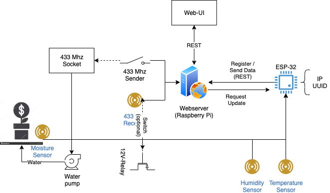

# Smarthome

System for making your home smarter.

## Overview

## Hardware

- [Motion-Sensor](https://www.amazon.de/AZDelivery-HC-SR501-Bewegungssensor-Bewegungsmelde-Arduino/dp/B07CNBYRQ7/ref=sr_1_5?__mk_de_DE=%C3%85M%C3%85%C5%BD%C3%95%C3%91&crid=17PMSO2I5EKWL&dchild=1&keywords=arduino+bewegungsmelder&qid=1604167893&sprefix=arduino+bewe%2Caps%2C170&sr=8-5)
- [Temperature-Sensor](https://www.amazon.de/AZDelivery-digitaler-Temperatursensor-Temperaturf%C3%BChler-wasserdicht/dp/B075FYYLLV/ref=sr_1_5?__mk_de_DE=%C3%85M%C3%85%C5%BD%C3%95%C3%91&dchild=1&keywords=temperatursensor&qid=1604168464&sr=8-5)
- [Moisture-Sensor](https://www.amazon.de/AZDelivery-Bodenfeuchtesensor-Hygrometer-kapazitiv-Arduino/dp/B07V6M5C4H/ref=sr_1_5?__mk_de_DE=%C3%85M%C3%85%C5%BD%C3%95%C3%91&dchild=1&keywords=feuchtigkeitssensor+kapazitiv&qid=1604168494&sr=8-5)
- [Humidity-Sensor](https://www.amazon.de/AZDelivery-Breakout-Platine-Temperatursensor-Luftfeuchtigkeitssensor/dp/B07CK598SZ/ref=sr_1_6?__mk_de_DE=%C3%85M%C3%85%C5%BD%C3%95%C3%91&dchild=1&keywords=Humidity+sensor+arduino&qid=1604168570&sr=8-6)
- [ESP-32](https://www.amazon.de/AZDelivery-NodeMCU-Development-Nachfolgermodell-ESP8266/dp/B074RGW2VQ/ref=sr_1_3?__mk_de_DE=%C3%85M%C3%85%C5%BD%C3%95%C3%91&dchild=1&keywords=ESP32&qid=1604168599&sr=8-3)
- [Wechselschalter 433 Mhz](https://www.amazon.de/Funk-Schalter-Funk-Empf%C3%A4nger-Wand-Schalter-Wechselschaltung-Reichweite/dp/B07S2YWJQQ/ref=sr_1_5?__mk_de_DE=%C3%85M%C3%85%C5%BD%C3%95%C3%91&dchild=1&keywords=wechselschalter+funk&qid=1604168724&sr=8-5)
